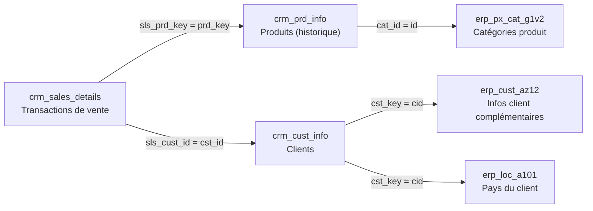

# Projet Data Warehouse et Analytics

Bienvenue dans le dépôt du **Projet Data Warehouse et Analytics** ! 🚀  
Ce projet présente une solution complète d'entreposage de données et d'analytics, depuis la construction du data warehouse jusqu'à la génération d'insights exploitables. Conçu comme projet de portfolio, il met en avant les bonnes pratiques du secteur en data engineering et analytics.

Il s'agit d'une adaptation en français du projet [SQL Data Warehouse](https://github.com/DataWithBaraa/sql-data-warehouse-project) de Data with Baraa.

---

##  Architecture des données

L'architecture suit le modèle **Medallion**, avec trois couches **Bronze**, **Silver** et **Gold** :


1. **Couche Bronze** : stocke les données brutes telles quelles depuis les systèmes sources. Les données sont chargées depuis des fichiers CSV vers SQL Server.
2. **Couche Silver** : nettoyage, standardisation et normalisation des données pour les préparer à l'analyse.
3. **Couche Gold** : données prêtes pour le métier, modélisées en schéma en étoile pour le reporting et l'analytics.

### Flux de données

Le lignage des données, de chaque fichier source jusqu'aux objets de la couche Gold :


### Intégration des sources

Les deux systèmes sources se relient par les clés suivantes (après nettoyage en Silver) :



- `cat_id` est extrait des 5 premiers caractères de `prd_key` (ex. `CO-RF` → `CO_RF`).
- Dans `erp_cust_az12`, le préfixe `NAS` est retiré de `cid` (`NASAW00011000` → `AW00011000`).
- Dans `erp_loc_a101`, les tirets sont retirés de `cid` (`AW-00011000` → `AW00011000`).

---

## 📖 Présentation du projet

Ce projet couvre :

1. **Architecture des données** : conception d'un data warehouse moderne selon l'architecture Medallion (Bronze, Silver, Gold).
2. **Pipelines ETL** : extraction, transformation et chargement des données depuis les systèmes sources vers le data warehouse.
3. **Modélisation des données** : création de tables de faits et de dimensions optimisées pour les requêtes analytiques.
4. **Analytics & Reporting** : création de rapports et d'analyses SQL pour produire des insights exploitables.

 Ce dépôt est une ressource utile pour les profils souhaitant démontrer leurs compétences en :
- Développement SQL
- Architecture de données
- Data Engineering
- Développement de pipelines ETL
- Modélisation de données
- Analyse de données

---

##  Outils utilisés

- **[Datasets](datasets/)** : fichiers CSV du projet (CRM et ERP).
- **[SQL Server Express](https://www.microsoft.com/fr-fr/sql-server/sql-server-downloads)** : serveur de base de données (version 2022 ou supérieure, pour la fonction `DATETRUNC` utilisée dans les analyses).
- **[SQL Server Management Studio (SSMS)](https://learn.microsoft.com/fr-fr/sql/ssms/download-sql-server-management-studio-ssms)** : interface graphique pour administrer la base et exécuter les scripts.
- **[Draw.io](https://www.drawio.com/)** : conception de l'architecture et des diagrammes.

---

##  Démarrage rapide

1. Copier le dossier `datasets/` à un emplacement accessible par le service SQL Server, puis adapter si besoin les chemins `BULK INSERT` dans [scripts/bronze/proc_load_bronze.sql](scripts/bronze/proc_load_bronze.sql) (par défaut `C:\sql-data-warehouse-project\datasets\...`).
2. Exécuter les scripts dans l'ordre suivant :

| Étape | Script | Rôle |
|-------|--------|------|
| 1 | [scripts/init_database.sql](scripts/init_database.sql) | Crée la base `DataWarehouse` et les schémas `bronze`, `silver`, `gold` (⚠️ supprime la base si elle existe). |
| 2 | [scripts/bronze/ddl_bronze.sql](scripts/bronze/ddl_bronze.sql) | Crée les tables Bronze. |
| 3 | [scripts/bronze/proc_load_bronze.sql](scripts/bronze/proc_load_bronze.sql) | Crée la procédure `bronze.load_bronze`. |
| 4 | [scripts/silver/ddl_silver.sql](scripts/silver/ddl_silver.sql) | Crée les tables Silver. |
| 5 | [scripts/silver/proc_load_silver.sql](scripts/silver/proc_load_silver.sql) | Crée la procédure `silver.load_silver`. |
| 6 | `EXEC bronze.load_bronze;` puis `EXEC silver.load_silver;` | Charge les données. |
| 7 | [scripts/gold/ddl_gold.sql](scripts/gold/ddl_gold.sql) | Crée les vues du schéma en étoile. |
| 8 | [scripts/gold/ddl_gold_reports.sql](scripts/gold/ddl_gold_reports.sql) | Crée les vues de reporting. |
| 9 | [tests/quality_checks_silver.sql](tests/quality_checks_silver.sql), [tests/quality_checks_gold.sql](tests/quality_checks_gold.sql) | Contrôles qualité. |
| 10 | [scripts/analytics/analyses_metier.sql](scripts/analytics/analyses_metier.sql) | Analyses métier. |

---

##  Exigences du projet

### Construction du Data Warehouse (Data Engineering)

#### Objectif
Développer un data warehouse moderne avec SQL Server pour consolider les données de vente, en vue de reporting analytique et d'aide à la décision.

#### Spécifications
- **Sources de données** : Import de données depuis deux systèmes sources (ERP et CRM) fournis sous forme de fichiers CSV.
- **Qualité des données** : Nettoyage et résolution des problèmes de qualité des données avant analyse.
- **Intégration** : Combinaison des deux sources en un modèle de données unique et accessible, conçu pour les requêtes analytiques.
- **Périmètre** : Focus sur le dernier jeu de données uniquement ; la gestion de l'historique n'est pas requise.
- **Documentation** : Fourniture d'une documentation claire du modèle de données pour les équipes métier et analytics.

---

### BI : Analytics & Reporting (Data Analysis)

#### Objectif
Développer des analyses SQL pour produire des insights détaillés sur :
- **Le comportement client**
- **La performance produit**
- **Les tendances de vente**

Ces insights fournissent aux parties prenantes des indicateurs métier clés pour une prise de décision stratégique.

Les requêtes correspondantes se trouvent dans [scripts/analytics/analyses_metier.sql](scripts/analytics/analyses_metier.sql), et le modèle de données est documenté dans le [catalogue de données](docs/catalogue_de_donnees.md).

---

## 📂 Structure du dépôt

```
sql-data-warehouse-project/
│
├── datasets/                              # Données brutes (fichiers CSV ERP et CRM)
│   ├── source_crm/
│   └── source_erp/
│
├── docs/                                  # Documentation du projet
│   ├── Architecture de données.drawio     # Diagramme d'architecture (source draw.io)
│   ├── Architecture_de_données.drawio.png # Diagramme d'architecture (image)
│   ├── Flux de données.drawio             # Diagramme du flux de données (source draw.io)
│   ├── Flux_de_données.drawio.png         # Diagramme du flux de données (image)
│   ├── catalogue_de_donnees.md            # Catalogue de la couche Gold (champs, descriptions, modèle en étoile)
│   └── conventions_de_nommage.md          # Conventions de nommage des tables, colonnes et fichiers
│
├── scripts/                               # Scripts SQL d'ETL et de transformation
│   ├── init_database.sql                  # Création de la base et des schémas
│   ├── bronze/                            # Extraction et chargement des données brutes
│   ├── silver/                            # Nettoyage et transformation des données
│   ├── gold/                              # Création des modèles analytiques et des rapports
│   └── analytics/                         # Analyses métier
│
├── tests/                                 # Scripts de contrôle qualité
│
├── README.md                              # Présentation du projet
└── LICENSE                                # Licence du dépôt
```

---

## 🛡️ Licence

Ce projet est sous licence [MIT](LICENSE). Vous êtes libre de l'utiliser, le modifier et le partager avec attribution appropriée.

## 👤 A propos de moi 

Je suis Steven Mouthoud étudiant en Data ayant pour objectif d'être un Data Engineer accompli.
