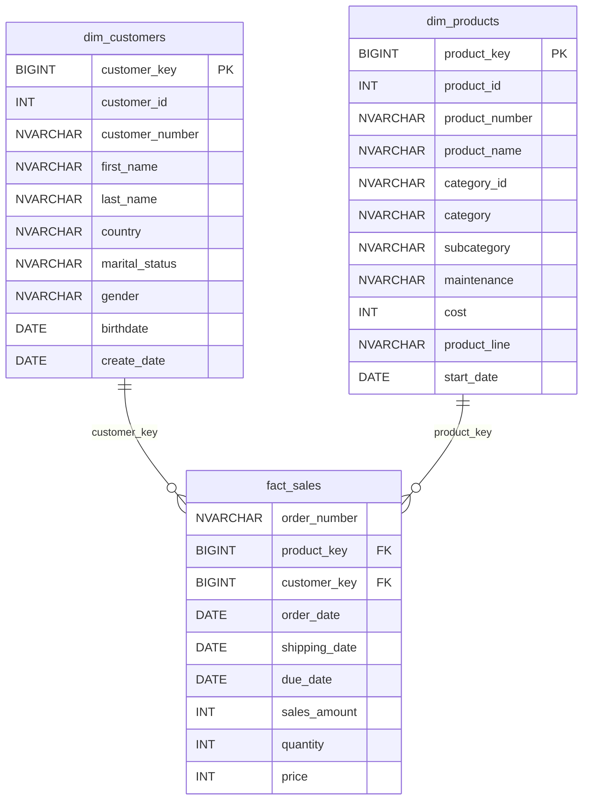

# **Catalogue de données de la couche Gold**

## **Vue d'ensemble**

La couche Gold est la représentation des données au niveau métier, structurée pour répondre aux cas d'usage analytiques et de reporting. Elle se compose de **tables de dimension** et d'une **table de faits** organisées en **schéma en étoile**, complétées par des **vues de reporting** qui agrègent les indicateurs clés.

Tous les objets de la couche Gold sont des **vues** : aucune donnée n'y est physiquement stockée, elles sont calculées à partir de la couche Silver à chaque requête.

## **Modèle de données (schéma en étoile)**

**Règle de calcul des ventes :** `sales_amount = quantity * price`

---

### 1. **gold.dim_customers**

- **Objectif :** Stocke les informations clients enrichies de données démographiques et géographiques.
- **Sources :** `silver.crm_cust_info`, `silver.erp_cust_az12`, `silver.erp_loc_a101`
- **Colonnes :**

| Nom de colonne   | Type de données | Description                                                                                          |
|------------------|-----------------|------------------------------------------------------------------------------------------------------|
| customer_key     | BIGINT          | Clé de substitution identifiant de manière unique chaque client dans la dimension.                    |
| customer_id      | INT             | Identifiant numérique unique attribué à chaque client dans le CRM.                                    |
| customer_number  | NVARCHAR(50)    | Identifiant alphanumérique du client, utilisé pour le suivi et le référencement (ex. `AW00011000`).  |
| first_name       | NVARCHAR(50)    | Prénom du client, tel qu'enregistré dans le système.                                                 |
| last_name        | NVARCHAR(50)    | Nom de famille du client.                                                                            |
| country          | NVARCHAR(50)    | Pays de résidence du client (ex. `Australie`, `États-Unis`), `n/a` si inconnu.                       |
| marital_status   | NVARCHAR(50)    | Statut marital du client (ex. `Marié(e)`, `Célibataire`).                                            |
| gender           | NVARCHAR(50)    | Genre du client (ex. `Masculin`, `Féminin`, `n/a`). Le CRM est prioritaire, l'ERP sert de repli.      |
| birthdate        | DATE            | Date de naissance du client, au format AAAA-MM-JJ (ex. `1971-10-06`).                                |
| create_date      | DATE            | Date de création de l'enregistrement client dans le système.                                         |

---

### 2. **gold.dim_products**

- **Objectif :** Fournit les informations sur les produits et leurs attributs. Seuls les produits **actuellement actifs** sont conservés (l'historique des versions de produit est exclu).
- **Sources :** `silver.crm_prd_info`, `silver.erp_px_cat_g1v2`
- **Colonnes :**

| Nom de colonne  | Type de données | Description                                                                                          |
|-----------------|-----------------|------------------------------------------------------------------------------------------------------|
| product_key     | BIGINT          | Clé de substitution identifiant de manière unique chaque produit dans la dimension.                   |
| product_id      | INT             | Identifiant unique attribué au produit, à usage interne.                                             |
| product_number  | NVARCHAR(50)    | Code alphanumérique structuré représentant le produit (ex. `BK-R93R-62`).                            |
| product_name    | NVARCHAR(50)    | Nom descriptif du produit, incluant des détails comme le type, la couleur et la taille.              |
| category_id     | NVARCHAR(50)    | Identifiant de la catégorie du produit, faisant le lien avec sa classification (ex. `BI_RB`).        |
| category        | NVARCHAR(50)    | Classification générale du produit (ex. `Bikes`, `Components`).                                      |
| subcategory     | NVARCHAR(50)    | Classification plus détaillée du produit au sein de sa catégorie (ex. `Road Bikes`).                 |
| maintenance     | NVARCHAR(50)    | Indique si le produit nécessite une maintenance (`Yes`, `No`).                                       |
| cost            | INT             | Coût du produit en unités monétaires.                                                                |
| product_line    | NVARCHAR(50)    | Gamme de produit (ex. `Route`, `Montagne`, `Touring`, `Autres ventes`).                              |
| start_date      | DATE            | Date à partir de laquelle le produit est disponible à la vente.                                      |

---

### 3. **gold.fact_sales**

- **Objectif :** Stocke les données transactionnelles de vente à des fins d'analyse.
- **Sources :** `silver.crm_sales_details`, `gold.dim_products`, `gold.dim_customers`
- **Granularité :** une ligne par ligne de commande (commande × produit).
- **Colonnes :**

| Nom de colonne  | Type de données | Description                                                                                          |
|-----------------|-----------------|------------------------------------------------------------------------------------------------------|
| order_number    | NVARCHAR(50)    | Identifiant alphanumérique unique de chaque commande (ex. `SO54496`).                                |
| product_key     | BIGINT          | Clé de substitution reliant la commande à la dimension produit.                                      |
| customer_key    | BIGINT          | Clé de substitution reliant la commande à la dimension client.                                       |
| order_date      | DATE            | Date à laquelle la commande a été passée.                                                            |
| shipping_date   | DATE            | Date à laquelle la commande a été expédiée au client.                                                |
| due_date        | DATE            | Date d'échéance du paiement de la commande.                                                          |
| sales_amount    | INT             | Montant total de la vente pour la ligne, en unités monétaires entières (ex. `25`).                   |
| quantity        | INT             | Nombre d'unités du produit commandées pour la ligne (ex. `1`).                                       |
| price           | INT             | Prix unitaire du produit pour la ligne, en unités monétaires entières (ex. `25`).                    |

---

## **Vues de reporting**

### 4. **gold.report_customers**

- **Objectif :** Consolide les indicateurs clés et le comportement d'achat de chaque client ayant passé au moins une commande.
- **Sources :** `gold.fact_sales`, `gold.dim_customers`
- **Colonnes :**

| Nom de colonne     | Type de données | Description                                                                                  |
|--------------------|-----------------|----------------------------------------------------------------------------------------------|
| customer_key       | BIGINT          | Clé de substitution du client.                                                               |
| customer_number    | NVARCHAR(50)    | Identifiant alphanumérique du client.                                                        |
| customer_name      | NVARCHAR(101)   | Prénom et nom du client.                                                                     |
| age                | INT             | Âge du client (en années).                                                                   |
| age_group          | VARCHAR         | Tranche d'âge (`Moins de 20 ans`, `20-29 ans`, …, `50 ans et plus`, `n/a`).                  |
| customer_segment   | VARCHAR         | `VIP` (≥ 12 mois d'historique et > 5 000 de ventes), `Régulier` (≥ 12 mois et ≤ 5 000), `Nouveau` (< 12 mois). |
| last_order_date    | DATE            | Date de la dernière commande.                                                                |
| recency            | INT             | Nombre de mois écoulés depuis la dernière commande.                                          |
| total_orders       | INT             | Nombre de commandes distinctes.                                                              |
| total_sales        | INT             | Montant total des ventes.                                                                    |
| total_quantity     | INT             | Quantité totale achetée.                                                                     |
| total_products     | INT             | Nombre de produits distincts achetés.                                                        |
| lifespan           | INT             | Nombre de mois entre la première et la dernière commande.                                    |
| avg_order_value    | INT             | Panier moyen (ventes totales / nombre de commandes).                                         |
| avg_monthly_spend  | INT             | Dépense mensuelle moyenne (ventes totales / ancienneté).                                     |

### 5. **gold.report_products**

- **Objectif :** Consolide les indicateurs clés de performance de chaque produit vendu.
- **Sources :** `gold.fact_sales`, `gold.dim_products`
- **Colonnes :**

| Nom de colonne       | Type de données | Description                                                                                |
|----------------------|-----------------|--------------------------------------------------------------------------------------------|
| product_key          | BIGINT          | Clé de substitution du produit.                                                            |
| product_name         | NVARCHAR(50)    | Nom du produit.                                                                            |
| category             | NVARCHAR(50)    | Catégorie du produit.                                                                      |
| subcategory          | NVARCHAR(50)    | Sous-catégorie du produit.                                                                 |
| cost                 | INT             | Coût du produit.                                                                           |
| last_sale_date       | DATE            | Date de la dernière vente.                                                                 |
| recency_in_months    | INT             | Nombre de mois écoulés depuis la dernière vente.                                           |
| product_segment      | VARCHAR         | `Haute performance` (> 50 000), `Performance moyenne` (10 000 – 50 000), `Faible performance` (< 10 000). |
| lifespan             | INT             | Nombre de mois entre la première et la dernière vente.                                     |
| total_orders         | INT             | Nombre de commandes distinctes.                                                            |
| total_sales          | INT             | Montant total des ventes.                                                                  |
| total_quantity       | INT             | Quantité totale vendue.                                                                    |
| total_customers      | INT             | Nombre de clients distincts.                                                               |
| avg_selling_price    | FLOAT           | Prix de vente moyen.                                                                       |
| avg_order_revenue    | INT             | Revenu moyen par commande.                                                                 |
| avg_monthly_revenue  | INT             | Revenu mensuel moyen.                                                                      |
